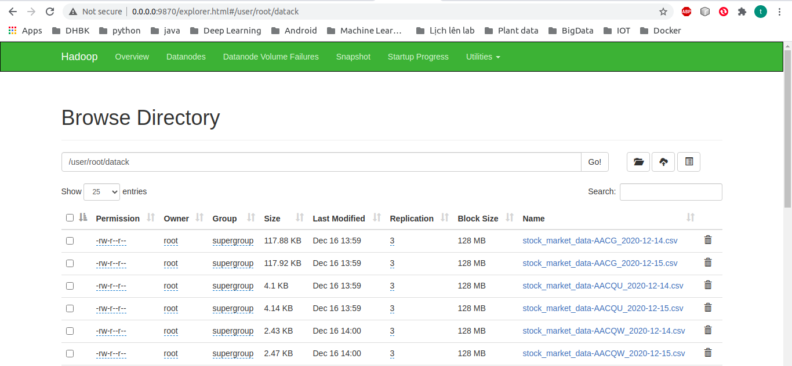

# Big Data Project: Stock Price Big Data 

Áp dụng các công nghệ big data vào việc lưu trữ và xử lý các dữ liệu trên thị trường chứng khoán (cụ thể là thị trường ở Mỹ).

Nhóm 10:
- Nguyễn Sơn Tùng 20173449
- Lê Thành Sơn 20173346
- Mai Đức Trung 20173417
- Nguyễn Sĩ Hưởng 20173165
- Hà Duy Hiếu 20173117

# Tổng quan đề tài:

Kịch bản của thị trường chứng khoán không ngừng chuyển động khi hàng ngày có đến hàng triệu lượt giao dịch. Việc áp dụng xử lý dữ liệu lớn vào môi trường chứng khoán trở thành một công cụ hữu hiệu cho các nhà đầu tư. Các phân tích dữ liệu lớn sẽ giúp các nhà đầu tư đưa ra những quyết định thông minh, hạn chế rủi ro trên môi trường đầy biến động này.

Project của nhóm hướng đến việc mô phỏng một hệ thống big data sử dụng hadoop và spark cho việc lưu trữ và xử lý dữ liệu chứng khoán ở Mỹ (từ năm 1999 đến 2020).

# Mô hình hệ thống:

Dữ liệu được lưu trữ trên một cụm HDFS bao gồm:
- 1 Namenode để quản lý các datanode
- 4 Datanode để lưu trữ dữ liệu.
Để lấy dữ liệu ra và xử lý, nhóm demo sử dụng một cụm spark gồm 1 Spark Master và 4 Spark Worker.

# Công nghệ sử dụng:
Hadoop 3.2.1 và Spark 3.0.1.
Dùng nền tảng docker để xây dựng hệ thống mô phỏng. Sử dụng các image của nhóm Big Data Europe (bde2020) để tạo ra namenode, các datanode, dịch vụ yarn, sparkmaster và các sparkworker. 
Sử dụng image pyspark-notebook của jupyter để demo việc xử lý dữ liệu của cụm spark (xem file docker-compose.yml)

# Lấy dữ liệu và lưu trữ:

Đầu tiên lấy mã và tên của các công ty trên sàn chứng khoán của Mỹ trên trang web eoddata.com (cụ thể: http://eoddata.com/symbols.aspx). Sau đó xử lý và chỉ dữ lại mã của các công ty. Sử dụng danh sách mã đó để lấy thông tin chứng khoán theo ngày của các công ty trên trang https://www.alphavantage.co/. Dữ liệu của mỗi công ty được lưu vào một file .csv. Toàn bộ dữ liệu được chứa trong folder datack. Chuyển dữ liệu vào namenode bằng lệnh sau:

```
docker cp ./datack container_id:datack
```

Sau đó put dữ liệu lên hdfs:

```
hdfs dfs -put datack 
```

Như vậy ta đã lưu trữ dữ liệu chứng khoán thành công, có thể xem cách hệ thống hdfs phân bố dữ liệu qua các lệnh hdfs trên namenode hoặc truy cập vào địa chỉ của namenode trên browser, trong trường hợp này là 0.0.0.0:9870 (tùy vào cổng được config trong file docker-compose, thường là 9870).



# Xử lý dữ liệu:

Việc demo thực thi xử lý dữ liệu được thực hiện trên pyspark-notebook, xem file Stock_price_demo.ipynb trong thư mục notebook.


